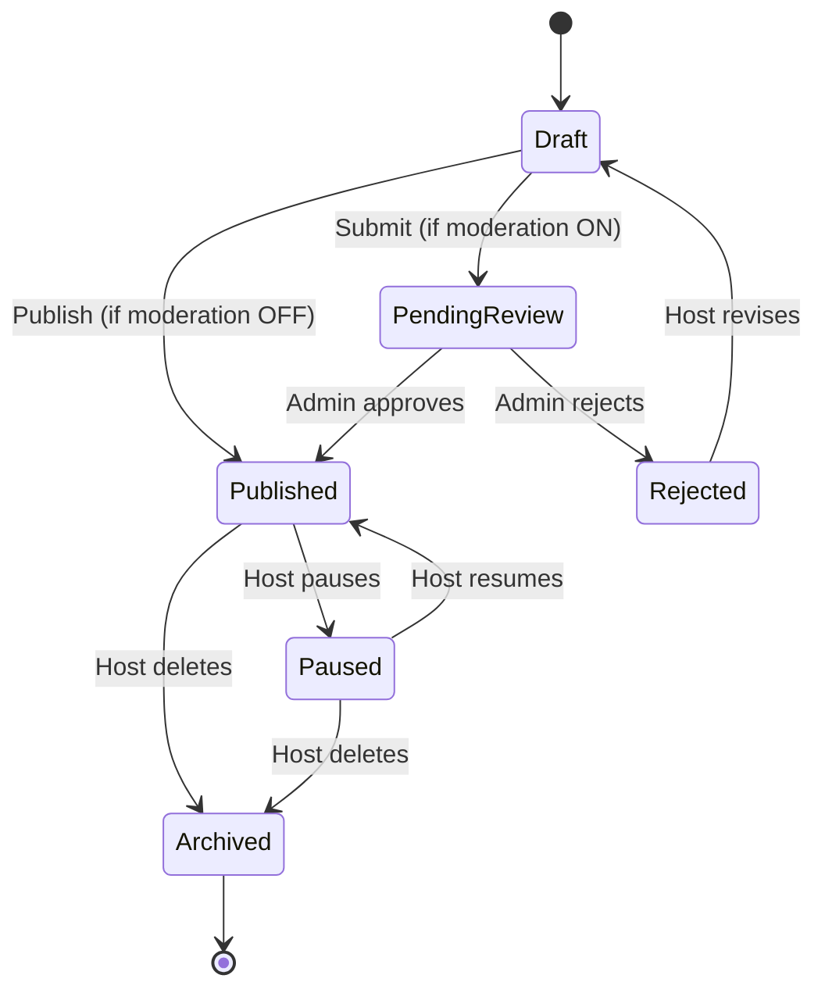
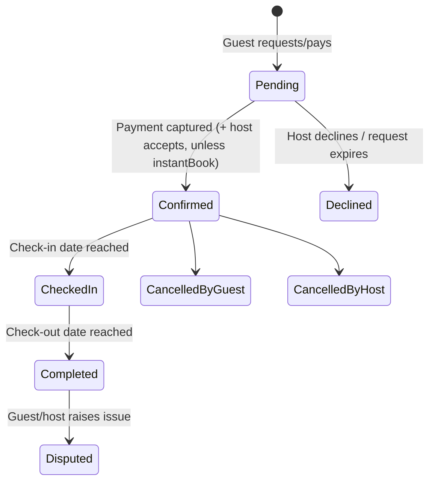
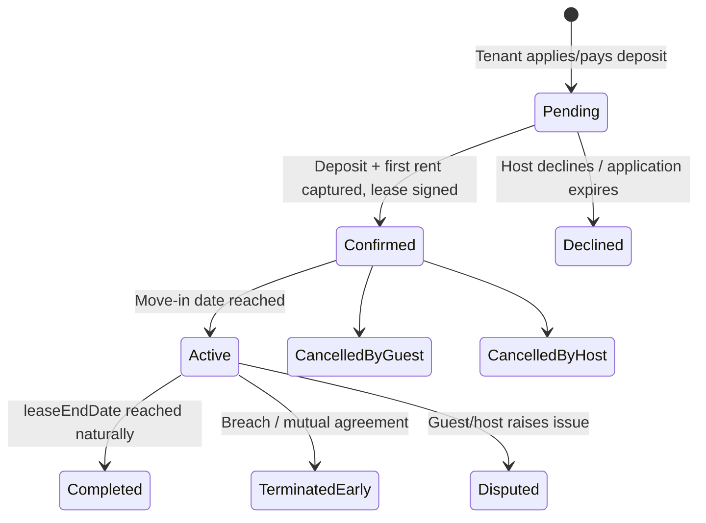
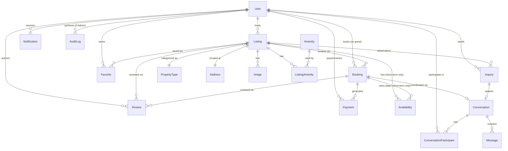

# Domain Model Specification

**Status:** Source of truth for all entity design. Confirmed scope (client decision, recorded here so it is never re-litigated): the platform supports **two rental transaction types — short-term (nightly/weekly) and long-term (monthly/annual lease) — on a single unified Property Listing model.** No other transaction types (sales, commercial leasing, cars, experiences) are in scope.

---

## 0. Design Principles for This Model

1. **One `Listing` entity, not one-per-rental-type.** A listing has a `rentalType` (`SHORT_TERM` | `LONG_TERM`) and one coherent set of shared fields; rental-type-specific fields live on the same table, nullable, and are required/forbidden based on `rentalType` via application-layer validation (a Zod discriminated union) plus a DB `CHECK` constraint as a safety net. This is **not** table-per-type inheritance or a polymorphic association — it is one flat, unified model, per instruction.
2. **`Booking` follows the same pattern.** One `Booking` entity represents both a short-term reservation and a long-term lease, distinguished by `rentalType` (snapshotted from the listing at creation) with conditional fields, rather than separate `Booking`/`Lease` tables.
3. **No entities were added beyond what's needed to support this.** Two candidates that a more "complete" design might add — a separate `HostProfile` and a separate `Payout` entity — are deliberately **not** introduced; host-specific fields live on `User`, and payouts are modeled as a `Payment` row (`type = PAYOUT`). Rationale for each is called out inline. If host-specific fields or payout batching genuinely outgrow this later, splitting them out is a low-risk additive change — not a reason to build the split now.
4. **Availability is short-term-only and sparse.** Long-term rentals don't need a day-by-day calendar — occupancy is derived from whether an `ACTIVE` `Booking` (lease) currently exists. The `Availability` table only stores non-default rows (`BLOCKED`/`BOOKED`); it does not pre-populate one row per date per listing.
5. **Payments are provider-agnostic.** The `Payment` entity has no Stripe-specific fields (no `stripePaymentIntentId`) — it stores a `provider` enum and an opaque `providerTransactionRef`. See §6 for the abstraction that sits behind it.

---

## 1. Shared vs. Rental-Type-Aware Entities

| Shared entities (identical behavior regardless of rental type) | Rental-type-aware entities (single table, conditional fields) |
|---|---|
| `User`, `PropertyType`, `Amenity`, `Address`, `Image`, `Inquiry`, `Review`, `Favorite`, `Conversation`, `Message`, `Notification`, `NotificationPreference`, `AuditLog` | `Listing`, `Booking`, `Payment` (billing-period fields only), `Availability` (short-term-only entity, not applicable to long-term at all) |

---

## 2. Entity Specifications

### 2.1 User

**Purpose:** Any platform account. Roles are non-exclusive — a user can be Guest/Tenant, Host, and (separately) Admin simultaneously. Host-specific fields (bio, response metrics, payout reference) live directly on `User` rather than a separate `HostProfile` — see §0.3.

| Field | Type | Notes |
|---|---|---|
| `id` | UUID (PK) | |
| `email` | String | Unique |
| `passwordHash` | String, nullable | Nullable if OAuth-only |
| `firstName`, `lastName` | String | |
| `phone` | String, nullable | E.164 |
| `avatarUrl` | String, nullable | |
| `roles` | Enum[] {GUEST, HOST, ADMIN} | Non-exclusive set |
| `dateOfBirth` | Date, nullable | |
| `bio` | Text, nullable | Host-facing "About me"; irrelevant but harmless for guest-only users |
| `responseRate`, `responseTimeMinutes` | Decimal / Integer, nullable | Host metrics, computed from Message data, not user-editable |
| `isVerified` | Boolean, default false | Identity verification flag |
| `payoutAccountRef` | String, nullable | Opaque reference into whichever `PaymentProvider` is active (§6) — never a provider-specific field name |
| `emailVerifiedAt` | DateTime, nullable | |
| `status` | Enum {ACTIVE, SUSPENDED, DELETED} | |
| `createdAt`, `updatedAt` | DateTime | |

**Validation:** `email` required, RFC-valid, unique. `roles` must be non-empty. `phone` E.164 if present. `passwordHash` required unless an OAuth identity exists.

**Relationships:** 1—N `Listing` (host), 1—N `Booking` (guest), 1—N `Review` (author), 1—N `Favorite`, 1—N `Message` (sender), N—N `Conversation` (via `ConversationParticipant`), 1—N `Notification`, 1—N `Inquiry` (sender), 1—N `AuditLog` (actor), 1—N `Payment` (payer/payee).

**Status values:** `ACTIVE`, `SUSPENDED` (admin action, login blocked), `DELETED` (soft-delete; retained for referential integrity of past bookings/reviews — never hard-deleted).

**Permissions:** Only `HOST`-role users may create a `Listing`. Only `ADMIN` may change another user's `status` or `roles`. Every other field is self-editable by the owning user, or admin-editable.

**Lifecycle:** `Registered` (unverified) → `Verified` (email confirmed) → `Active` → `Suspended` (admin) → `Deleted` (soft).

**Indexes:** unique(`email`); GIN index on `roles` (Postgres array); index(`status`).

---

### 2.2 PropertyType

**Purpose:** Admin-managed taxonomy of property categories (Apartment, House, Studio, Condo, Townhouse, …). Shared identically by both rental types.

| Field | Type | Notes |
|---|---|---|
| `id` | UUID (PK) | |
| `name` | String | Unique |
| `slug` | String | Unique |
| `description` | Text, nullable | |
| `icon` | String, nullable | |
| `isActive` | Boolean, default true | Soft-disable, never delete (listings reference it) |
| `createdAt`, `updatedAt` | DateTime | |

**Validation:** `name`/`slug` required, unique.

**Relationships:** 1—N `Listing`.

**Status values:** `isActive` true/false.

**Permissions:** `ADMIN` only.

**Lifecycle:** Created → Active → Deprecated (`isActive = false`; no longer selectable for new listings, existing listings keep their reference).

**Indexes:** unique(`slug`), unique(`name`).

---

### 2.3 Amenity

**Purpose:** Admin-managed taxonomy of listing features (WiFi, Parking, Pool, In-unit laundry, …), many-to-many with `Listing`, shared by both rental types.

| Field | Type | Notes |
|---|---|---|
| `id` | UUID (PK) | |
| `name` | String | Unique |
| `slug` | String | Unique |
| `category` | Enum, nullable | e.g. `BASIC`, `SAFETY`, `OUTDOOR` — optional grouping for filter UI |
| `icon` | String, nullable | |
| `isActive` | Boolean, default true | |

**Relationships:** N—N `Listing` via `ListingAmenity(listingId, amenityId)` join table.

**Permissions:** `ADMIN` only.

**Lifecycle:** Created → Active → Deprecated.

**Indexes:** unique(`slug`); `ListingAmenity`: composite PK(`listingId`,`amenityId`), index each FK.

---

### 2.4 Address (Location)

**Purpose:** Structured, normalized location for a `Listing`. Separated from `Listing` for geocoding and future radius-search support.

| Field | Type | Notes |
|---|---|---|
| `id` | UUID (PK) | |
| `listingId` | UUID (FK, unique) | 1:1 with Listing |
| `line1`, `line2` | String / nullable | |
| `city`, `region` | String | |
| `postalCode` | String | Format validated per `country` where feasible |
| `country` | String | ISO 3166-1 alpha-2 |
| `latitude`, `longitude` | Decimal, nullable | Populated by geocoding if not supplied directly |
| `formattedAddress` | String, nullable | Geocoder output |

**Validation:** `country` required and valid ISO code. `latitude` ∈ [-90,90], `longitude` ∈ [-180,180] if present.

**Relationships:** 1—1 `Listing` (cascade delete).

**Permissions:** Editable only by the listing's owning host, or admin.

**Lifecycle:** Created with the listing draft → updated as host edits → geocoded asynchronously if lat/lng absent.

**Indexes:** unique(`listingId`); index(`city`, `country`); index(`latitude`,`longitude`) — candidate for a PostGIS GIST index if/when radius search is added (not required at MVP).

---

### 2.5 Listing (Unified Property Listing Model)

**Purpose:** The single representation of a property, for either a short-term or a long-term rental. **One listing has exactly one `rentalType`, fixed once it leaves `DRAFT`** — see Design Decision below.

**Shared fields (both rental types):**

| Field | Type | Notes |
|---|---|---|
| `id` | UUID (PK) | |
| `hostId` | UUID (FK → User) | |
| `propertyTypeId` | UUID (FK → PropertyType) | |
| `title` | String | 10–100 chars |
| `slug` | String | Unique, generated from title |
| `description` | Text | 50–3000 chars |
| `rentalType` | Enum {SHORT_TERM, LONG_TERM} | Immutable after first non-DRAFT status |
| `bedrooms` | Integer | ≥ 0 |
| `bathrooms` | Decimal | ≥ 0, half-baths allowed |
| `maxOccupants` | Integer | ≥ 1 |
| `sizeSqft` | Integer, nullable | |
| `currency` | String | ISO 4217 |
| `status` | Enum | See lifecycle below |
| `avgRating`, `reviewCount` | Decimal / Integer | Denormalized, recalculated on Review write |
| `viewCount` | Integer, default 0 | |
| `publishedAt` | DateTime, nullable | |
| `createdAt`, `updatedAt` | DateTime | |

**Short-term-specific fields** (required if `rentalType = SHORT_TERM`; must be `NULL` if `LONG_TERM`):

| Field | Type | Notes |
|---|---|---|
| `nightlyPrice` | Decimal | > 0 |
| `cleaningFee` | Decimal, default 0 | ≥ 0 |
| `minNights` | Integer, default 1 | ≥ 1 |
| `maxNights` | Integer, nullable | ≥ `minNights` |
| `weeklyDiscountPercent`, `monthlyDiscountPercent` | Decimal, nullable | 0–100; `monthlyDiscountPercent` covers 28+ night stays *within* the short-term model — distinct from a long-term lease |
| `checkInTime`, `checkOutTime` | Time | e.g. `15:00` / `11:00` |
| `instantBook` | Boolean, default false | Auto-confirm vs. host approval required |

**Long-term-specific fields** (required if `rentalType = LONG_TERM`; must be `NULL` if `SHORT_TERM`):

| Field | Type | Notes |
|---|---|---|
| `monthlyRent` | Decimal | > 0 |
| `securityDeposit` | Decimal, default 0 | ≥ 0 |
| `minLeaseTermMonths` | Integer, default 12 | ≥ 1 |
| `maxLeaseTermMonths` | Integer, nullable | ≥ `minLeaseTermMonths` |
| `availableFromDate` | Date | |
| `utilitiesIncluded` | Boolean, default false | |
| `petPolicy` | Enum {NOT_ALLOWED, ALLOWED, CASE_BY_CASE} | |

**Validation rules:**
- `rentalType` required at creation; a Zod discriminated union on `rentalType` enforces the correct field group is present and the other is absent at the application layer. A DB `CHECK` constraint mirrors this as a safety net against writes that bypass the app layer.
- `rentalType` cannot change once `status` leaves `DRAFT` — prevents a listing's business rules changing underneath an existing tenant/guest.
- `slug` unique, URL-safe.
- At least one `Image` and a completed `Address` required before `status` can become `PUBLISHED`.

> **Design Decision — why one table, not `ShortTermListing`/`LongTermListing`:** a per-type sub-table (1:1 detail tables) was considered and rejected. It would satisfy "separate the business rules that differ" but reintroduces a join on every listing read/write and drifts toward the polymorphic design explicitly ruled out. A flat table with conditionally-required nullable columns keeps `Listing` genuinely singular while still cleanly separating the two field groups for anyone reading the schema.

**Relationships:** N—1 `User` (host), N—1 `PropertyType`, 1—1 `Address`, 1—N `Image`, N—N `Amenity`, 1—N `Availability` (short-term only, may be empty), 1—N `Booking`, 1—N `Favorite`, 1—N `Inquiry`.

**Status values:** `DRAFT`, `PENDING_REVIEW`, `PUBLISHED`, `PAUSED`, `ARCHIVED`, `REJECTED` — identical state machine for both rental types (publish/pause/archive is not a business-model-specific concern).

**Permissions:** Create/edit/delete: owning `HOST` or `ADMIN`. `PUBLISHED` listings are publicly visible; `DRAFT`/`PENDING_REVIEW`/`REJECTED` visible only to the owning host and `ADMIN`.

**Lifecycle:**


**Indexes:** unique(`slug`); index(`hostId`); index(`status`); index(`rentalType`); composite(`status`,`rentalType`,`propertyTypeId`) for search filtering; full-text (`tsvector`) index on `title`+`description`. *(Optimization candidate, not required at MVP: denormalize `city`/`country` from `Address` onto `Listing` to avoid a join on every search query — revisit if search latency demands it.)*

---

### 2.6 Image (ListingImage)

**Purpose:** Ordered photo gallery per listing. Identical for both rental types.

| Field | Type | Notes |
|---|---|---|
| `id` | UUID (PK) | |
| `listingId` | UUID (FK) | |
| `url` | String | Storage key/URL |
| `altText` | String, nullable | |
| `position` | Integer | Ordering, unique per listing |
| `isCover` | Boolean, default false | Exactly one `true` per listing (app-enforced) |
| `width`, `height` | Integer, nullable | From upload metadata |
| `createdAt` | DateTime | |

**Validation:** `url` required; `position` unique per `listingId`.

**Relationships:** N—1 `Listing`.

**Permissions:** Owning host or admin: add/remove/reorder.

**Lifecycle:** Uploaded → (optional async resize) → attached → deleted (with storage cleanup).

**Indexes:** composite(`listingId`,`position`).

---

### 2.7 Availability *(short-term only)*

**Purpose:** Sparse per-date calendar for `SHORT_TERM` listings — stores only non-default (`BLOCKED`/`BOOKED`) dates; an absent row means available. **Long-term listings never have rows here** — occupancy is derived from whether an `ACTIVE` `Booking` currently exists for that listing (see §2.9), since a lease doesn't need day-granularity.

| Field | Type | Notes |
|---|---|---|
| `id` | UUID (PK) | |
| `listingId` | UUID (FK) | Must reference a `SHORT_TERM` listing (app-enforced) |
| `date` | Date | |
| `status` | Enum {BLOCKED, BOOKED} | No `AVAILABLE` row is ever stored |
| `bookingId` | UUID (FK, nullable) | Set when `status = BOOKED` |
| `priceOverride` | Decimal, nullable | Per-night override for specific dates (e.g. holiday pricing) |

**Validation:** unique(`listingId`,`date`); `date` ≥ today for new host-created blocks; `status = BOOKED` requires `bookingId`.

**Relationships:** N—1 `Listing`; N—1 `Booking` (nullable).

**Permissions:** `BLOCKED` rows: created/removed by the owning host only. `BOOKED` rows: created only by the booking process (system) — never directly editable by host or guest.

**Lifecycle:** Row created on host block or booking confirmation → removed/reverted on cancellation or block removal.

**Indexes:** unique(`listingId`,`date`); index(`listingId`,`status`).

---

### 2.8 Inquiry

**Purpose:** Pre-booking contact from a prospective guest/tenant, before a formal `Booking` exists ("Is this available in March?" for short-term; "Can I schedule a viewing?" for long-term). Shared by both rental types.

| Field | Type | Notes |
|---|---|---|
| `id` | UUID (PK) | |
| `listingId` | UUID (FK) | |
| `senderId` | UUID (FK → User) | |
| `message` | Text | 1–2000 chars |
| `preferredDate` | Date, nullable | Preferred check-in (ST) or move-in (LT) |
| `status` | Enum {OPEN, RESPONDED, CONVERTED, CLOSED} | |
| `conversationId` | UUID (FK, nullable) | The Message thread it spawns |

**Validation:** `message` required; target `Listing.status = PUBLISHED`.

**Relationships:** N—1 `Listing`, N—1 `User` (sender), 1—1 `Conversation` (nullable).

**Permissions:** Created by any authenticated `GUEST`-role user; visible to sender, owning host, and admin.

**Lifecycle:** `OPEN` (sent) → `RESPONDED` (host replies) → `CONVERTED` (led to a Booking) or `CLOSED` (no action / expires).

**Indexes:** index(`listingId`), index(`senderId`), index(`status`).

---

### 2.9 Booking (Short-Term Reservation / Long-Term Lease)

**Purpose:** A single unified entity for a confirmed or in-progress rental transaction, covering both a short-term reservation and a long-term lease. `rentalType` is snapshotted from the listing at creation time (so a later listing edit never retroactively changes an existing booking's rules).

**Shared fields:**

| Field | Type | Notes |
|---|---|---|
| `id` | UUID (PK) | |
| `listingId` | UUID (FK) | |
| `guestId` | UUID (FK → User) | The renter/tenant |
| `hostId` | UUID (FK → User) | Denormalized from listing for query convenience |
| `rentalType` | Enum {SHORT_TERM, LONG_TERM} | Snapshotted, immutable |
| `status` | Enum | See below — shared column, type-conditional valid subset |
| `currency` | String | |
| `createdAt`, `updatedAt` | DateTime | |
| `cancelledAt` | DateTime, nullable | |
| `cancellationReason` | Text, nullable | |

**Short-term-specific fields** (present when `rentalType = SHORT_TERM`):

| Field | Type | Notes |
|---|---|---|
| `checkInDate`, `checkOutDate` | Date | `checkOutDate > checkInDate` |
| `nights` | Integer | Computed |
| `guestCount` | Integer | ≤ `listing.maxOccupants` |
| `nightlyRateSnapshot`, `cleaningFeeSnapshot` | Decimal | Price at time of booking, immune to later host price changes |
| `subtotal`, `serviceFee`, `totalPrice` | Decimal | |

**Long-term-specific fields** (present when `rentalType = LONG_TERM`):

| Field | Type | Notes |
|---|---|---|
| `leaseStartDate` | Date | ≥ `listing.availableFromDate` |
| `leaseEndDate` | Date, nullable | Null = open-ended/month-to-month |
| `leaseTermMonths` | Integer | Within listing's min/max lease term |
| `monthlyRentSnapshot`, `securityDepositSnapshot` | Decimal | Snapshotted at signing |
| `securityDepositPaid` | Boolean | |
| `rentDueDayOfMonth` | Integer, default 1 | 1–28 |

**Validation:**
- `rentalType` must match `listing.rentalType` at creation.
- Short-term: dates must not overlap any existing `BOOKED` `Availability` row for that listing — **enforced server-side at booking creation, not just in the UI.**
- Long-term: `leaseStartDate` ≥ `listing.availableFromDate`; `leaseTermMonths` within listing bounds.

**Relationships:** N—1 `Listing`, N—1 `User` (guest), N—1 `User` (host), 1—N `Payment`, 1—N `Availability` (short-term only — the booking "owns" its `BOOKED` date rows), 0/1—1 `Conversation`, up to two `Review` rows (guest→host, host→guest).

**Status values:**
- Shared core: `PENDING`, `CONFIRMED`, `CANCELLED_BY_GUEST`, `CANCELLED_BY_HOST`, `DECLINED`, `COMPLETED`, `DISPUTED`.
- Short-term-only addition: `CHECKED_IN` (between `CONFIRMED` and `COMPLETED`).
- Long-term-only additions: `ACTIVE` (between `CONFIRMED` and `COMPLETED`, i.e. tenant has moved in and lease is ongoing), `TERMINATED_EARLY` (lease ended before `leaseEndDate`).
- The application layer enforces which status subset is valid for a given `rentalType` — a validation rule, not a schema split.

**Permissions:** Created by a `GUEST`-role user. Guest may request cancellation; host may accept/decline/cancel; `ADMIN` may force any transition for dispute resolution.

**Lifecycle:**

Short-term reservation:


Long-term lease:


**Indexes:** index(`listingId`), index(`guestId`), index(`hostId`), index(`status`), index(`rentalType`); partial composite index(`listingId`,`checkInDate`,`checkOutDate`) `WHERE rentalType = 'SHORT_TERM'` for overlap queries; partial composite index(`listingId`,`leaseStartDate`,`leaseEndDate`) `WHERE rentalType = 'LONG_TERM'`.

---

### 2.10 Review

**Purpose:** Two-sided, double-blind review tied to a completed `Booking`. Identical mechanics for both rental types.

| Field | Type | Notes |
|---|---|---|
| `id` | UUID (PK) | |
| `bookingId` | UUID (FK) | |
| `listingId` | UUID (FK) | Denormalized from booking for simpler indexing/aggregation |
| `authorId` | UUID (FK → User) | |
| `direction` | Enum {GUEST_TO_HOST, HOST_TO_GUEST} | |
| `rating` | Integer | 1–5 |
| `subRatings` | JSON, nullable | `{cleanliness, communication, accuracy, location, value}` — `GUEST_TO_HOST` only |
| `comment` | Text | Required, non-empty |
| `hostResponse` | Text, nullable | One public reply, `GUEST_TO_HOST` reviews only |
| `isVisible` | Boolean, default false | See lifecycle |
| `createdAt`, `publishedAt` | DateTime | |

**Validation:** `rating` 1–5; `bookingId.status` must be `COMPLETED` or `TERMINATED_EARLY`; unique(`bookingId`,`direction`); author must be the corresponding participant of that booking.

**Relationships:** N—1 `Booking`, N—1 `Listing` (denormalized), N—1 `User` (author).

**Permissions:** Only the relevant booking participant may author; `ADMIN` may soft-hide for policy violations (audit-logged).

**Lifecycle:** Submitted (`isVisible = false`) → Published (`isVisible = true`, once both sides have submitted or a 14-day window expires) → optionally Hidden (admin moderation).

**Indexes:** unique(`bookingId`,`direction`); index(`listingId`); index(`authorId`).

---

### 2.11 Favorite

**Purpose:** Saved/wishlisted listings. Identical for both rental types.

| Field | Type |
|---|---|
| `id` | UUID (PK) |
| `userId` | UUID (FK) |
| `listingId` | UUID (FK) |
| `createdAt` | DateTime |

**Validation:** unique(`userId`,`listingId`).

**Relationships:** N—1 `User`, N—1 `Listing`.

**Permissions:** User manages own favorites only.

**Lifecycle:** Created → Deleted (unfavorite) — no intermediate state.

**Indexes:** unique(`userId`,`listingId`); index(`listingId`) for "most favorited" aggregate queries.

---

### 2.12 Conversation & Message

**Purpose:** Messaging thread between a guest/tenant and host, optionally tied to an `Inquiry` or `Booking`. Identical for both rental types.

**Conversation:**

| Field | Type |
|---|---|
| `id` | UUID (PK) |
| `listingId` | UUID (FK, nullable) |
| `bookingId` | UUID (FK, nullable) |
| `inquiryId` | UUID (FK, nullable) |
| `lastMessageAt` | DateTime |
| `createdAt` | DateTime |

`ConversationParticipant`: composite PK(`conversationId`,`userId`).

**Message:**

| Field | Type | Notes |
|---|---|---|
| `id` | UUID (PK) | |
| `conversationId` | UUID (FK) | |
| `senderId` | UUID (FK → User) | Must be a participant |
| `body` | Text | 1–5000 chars; required unless `attachmentUrl` present |
| `attachmentUrl` | String, nullable | |
| `readAt` | DateTime, nullable | |
| `createdAt` | DateTime | |

**Relationships:** `Conversation` N—N `User` via `ConversationParticipant`; `Conversation` 1—N `Message`; `Conversation` 0/1—1 `Booking`, 0/1—1 `Inquiry`.

**Permissions:** Only participants read/send; `ADMIN` may read for dispute resolution (audit-logged access).

**Lifecycle:** `Conversation` created on first message (from an `Inquiry` or `Booking` context) → ongoing; messages are immutable once sent (no edit/draft state at MVP).

**Indexes:** composite(`conversationId`,`createdAt`) on `Message`; index(`senderId`); index on `ConversationParticipant(userId)` for "my conversations."

---

### 2.13 Notification

**Purpose:** In-app / email notification record. Identical for both rental types; only the `type` vocabulary includes rental-type-specific triggers (e.g. `RENT_DUE_REMINDER` for long-term only).

| Field | Type | Notes |
|---|---|---|
| `id` | UUID (PK) | |
| `userId` | UUID (FK) | |
| `type` | Enum | `BOOKING_CONFIRMED`, `BOOKING_CANCELLED`, `NEW_MESSAGE`, `NEW_INQUIRY`, `REVIEW_RECEIVED`, `PAYOUT_SENT`, `LISTING_APPROVED`, `LISTING_REJECTED`, `RENT_DUE_REMINDER` (long-term only), … |
| `payload` | JSON | Shape validated per `type` |
| `channel` | Enum {IN_APP, EMAIL} | |
| `readAt` | DateTime, nullable | |
| `createdAt` | DateTime | |

`NotificationPreference`: composite PK(`userId`,`type`,`channel`), `enabled: Boolean`.

**Relationships:** N—1 `User`.

**Permissions:** User reads/marks-read own notifications; system creates all rows.

**Lifecycle:** Created (unread) → Read (`readAt` set).

**Indexes:** composite(`userId`,`readAt`); composite(`userId`,`createdAt`).

---

### 2.14 Payment

See §6 for the full provider-agnostic design rationale. Fields/lifecycle summarized here for completeness of the entity list.

| Field | Type | Notes |
|---|---|---|
| `id` | UUID (PK) | |
| `bookingId` | UUID (FK) | 1:1 with the triggering booking at MVP — see §0.3 on why a separate `Payout` entity was not introduced |
| `payerUserId`, `payeeUserId` | UUID (FK, nullable) | |
| `type` | Enum {CHARGE, REFUND, PAYOUT, SECURITY_DEPOSIT_HOLD, SECURITY_DEPOSIT_RELEASE} | |
| `amount` | Integer (minor units/cents) | > 0 |
| `currency` | String | ISO 4217, must match booking's currency |
| `provider` | Enum {STRIPE_CONNECT, PAYSTACK, FLUTTERWAVE, …} | Extensible |
| `providerTransactionRef` | String | Opaque to domain logic |
| `status` | Enum {PENDING, SUCCEEDED, FAILED, REFUNDED, PARTIALLY_REFUNDED} | |
| `billingPeriodStart`, `billingPeriodEnd` | Date, nullable | Long-term recurring rent only — identifies which month a charge covers; null for short-term one-time charges |
| `failureReason` | String, nullable | |
| `createdAt`, `updatedAt` | DateTime | |

**Validation:** `amount` > 0; `currency` matches booking; `billingPeriod*` required when `booking.rentalType = LONG_TERM AND type = CHARGE`, forbidden otherwise.

**Relationships:** N—1 `Booking`.

**Permissions:** System-created only, never directly user-editable; read access limited to payer, payee, and `ADMIN`.

**Lifecycle:** `PENDING` → `SUCCEEDED` (provider webhook confirms) → optionally `REFUNDED`/`PARTIALLY_REFUNDED` later. `FAILED` is terminal for that row — a retry creates a **new** `Payment` row (financial records are immutable, never mutated after the fact).

**Indexes:** index(`bookingId`), index(`status`), index(`provider`), index(`billingPeriodStart`) for recurring-rent queries; unique(`providerTransactionRef`) where not null.

---

### 2.15 AuditLog

**Purpose:** Immutable, append-only accountability trail of admin actions.

| Field | Type |
|---|---|
| `id` | UUID (PK) |
| `actorId` | UUID (FK → User, nullable for system actions) |
| `action` | String, e.g. `"listing.approve"`, `"user.suspend"`, `"payment.refund"` |
| `targetType` | String, e.g. `"Listing"`, `"User"`, `"Booking"` |
| `targetId` | UUID |
| `metadata` | JSON, nullable — before/after values or context |
| `createdAt` | DateTime |

**Validation:** `action`, `targetType` required. Rows are never updated or deleted at the application layer.

**Relationships:** N—1 `User` (actor, nullable).

**Permissions:** Write-only via system/admin actions; read-only, `ADMIN`-only access.

**Lifecycle:** Created, never modified — append-only.

**Indexes:** index(`actorId`); composite(`targetType`,`targetId`); index(`createdAt`).

---

## 3. Search & Filtering Implications

`rentalType` is now a **primary search facet**, not an afterthought — the two rental types have fundamentally different secondary filters and result semantics:

| | Short-term | Long-term |
|---|---|---|
| Primary date filter | `checkin` / `checkout` (range) | `moveIn` (single date, "available from") |
| Price filter | Per-night range, mapped to `nightlyPrice` | Per-month range, mapped to `monthlyRent` |
| Extra facets | `minNights`/`maxNights`, `instantBook` | `leaseTermMonths`, `petPolicy`, `utilitiesIncluded` |
| Availability check | Overlap query against `Availability` `BOOKED` rows for the requested date range | Existence check: `Listing.status = PUBLISHED AND availableFromDate <= requestedMoveIn AND` no `Booking` with `status IN (CONFIRMED, ACTIVE)` covering that date — no day-granularity table needed |
| Result card price display | `"$120/night"` | `"$1,800/month"` |

**URL contract:** `rentalType` becomes a required top-level query parameter (`?rentalType=SHORT_TERM&checkin=...` vs `?rentalType=LONG_TERM&moveIn=...`) — the search page reads it to decide which filter fields to render and which query branch to run. Both branches still resolve through one `searchListings(params)` function (per the Platform Architecture Blueprint §4 principle); it internally dispatches on `rentalType` rather than exposing two separate search entry points.

---

## 4. Payment Flow Differences

| | Short-term | Long-term |
|---|---|---|
| Trigger | Single charge at booking confirmation (full stay total, or deposit+balance per policy) | `SECURITY_DEPOSIT_HOLD` at lease signing, then one `CHARGE` per billing period (monthly) for the lease duration |
| Payment rows generated | One `CHARGE`, possible later `REFUND` on cancellation | One `SECURITY_DEPOSIT_HOLD` + N monthly `CHARGE` rows (`billingPeriodStart/End` populated) + one `SECURITY_DEPOSIT_RELEASE` at lease end |
| Scheduling | Immediate, request-driven | Recurring — a scheduled job (Platform Architecture Blueprint §15, background jobs) creates and attempts each month's `CHARGE` ahead of `rentDueDayOfMonth`, and triggers a `RENT_DUE_REMINDER` notification |
| Refund complexity | Policy-driven single refund calculation | Security deposit release may be partial (damage deductions) — a manual host/admin-initiated action, not automated |

Both flows call the **same** `PaymentProvider` interface (§6) — only the *scheduling* of one-time vs. repeated charges differs, and that logic lives in `modules/booking`, not in the payment abstraction itself. The abstraction only needs a "charge once" primitive; recurring rent is our own scheduled sequence of discrete charges, not a provider-specific "subscription" feature (subscription semantics differ enough across Stripe/Paystack/Flutterwave that depending on them would defeat the point of the abstraction).

---

## 5. Entity Relationship Diagram



---

## 6. Payment Provider Abstraction (Design)

Not a database entity — the architectural layer the `Payment` entity (§2.14) sits behind, per the instruction to avoid tight coupling to any single gateway.

```
PaymentProvider (interface, lib/payments/)
  createCharge(amount, currency, payerRef, metadata) → { providerTransactionRef, status }
  refund(providerTransactionRef, amount?) → { status }
  createPayeeAccount(user) → payoutAccountRef   // host payout onboarding
  payout(payoutAccountRef, amount, currency) → { providerTransactionRef, status }
  verifyWebhookSignature(payload, signature) → boolean
  parseWebhookEvent(payload) → NormalizedPaymentEvent

Concrete adapters (one file each, same interface):
  StripeConnectProvider
  PaystackProvider
  FlutterwaveProvider
```

- Business logic (`modules/booking`, `modules/payments`) calls **only** the `PaymentProvider` interface — never a provider SDK directly.
- The active provider is selected via configuration (env var / platform setting per currency or region if ever needed); `Payment.provider` records which one handled each transaction, so different bookings could even use different providers without a schema change.
- Webhook endpoints (`/api/webhooks/stripe`, `/api/webhooks/paystack`, …) each call their adapter's `verifyWebhookSignature`/`parseWebhookEvent`, then hand a **normalized** event to shared domain logic — the booking/payment state-transition code has no idea which provider fired the webhook.

---

## 7. Design Decisions Log

| Decision | Alternative considered | Why rejected |
|---|---|---|
| One `Listing` table with conditional fields | Separate `ShortTermListing`/`LongTermListing` tables, or a polymorphic base | Reintroduces a join on every read/write and the polymorphism explicitly ruled out; conditional-field validation achieves the same separation of business rules without it |
| One `Booking` table with conditional fields | Separate `Booking`/`Lease` entities | Same rationale — shared lifecycle scaffolding (Pending/Confirmed/Cancelled/Payment) would otherwise be duplicated across two tables |
| Host fields folded into `User` | Separate `HostProfile` entity | Not in the requested entity list; low cost to split out later if host-specific fields grow substantially — premature now |
| Payouts modeled as `Payment(type=PAYOUT)` | Separate `Payout` entity, possibly aggregating multiple bookings | Not in the requested entity list; MVP is 1 payout : 1 booking, which the existing `Payment` row already expresses. Revisit only if payout batching becomes a real operational need |
| `Availability` is sparse (stores only non-default dates) and short-term-only | Dense calendar (one row per date per listing, both rental types) | A dense table is pure storage/write overhead with no query benefit here; long-term occupancy is a simple existence check against `Booking`, not a calendar concern at all |
| `Review` uses an explicit `direction` enum, one row per direction | Two nullable rating/comment pairs on one row | Cleaner validation (`unique(bookingId, direction)`), avoids nullable-pair ambiguity about which side has and hasn't submitted |
