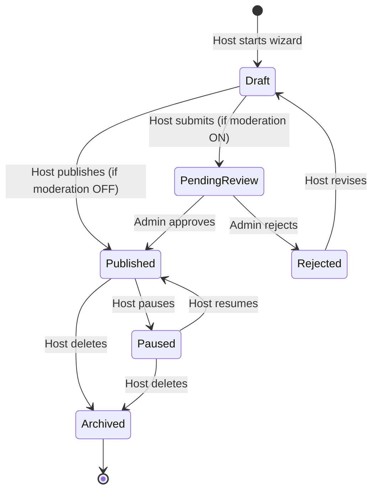
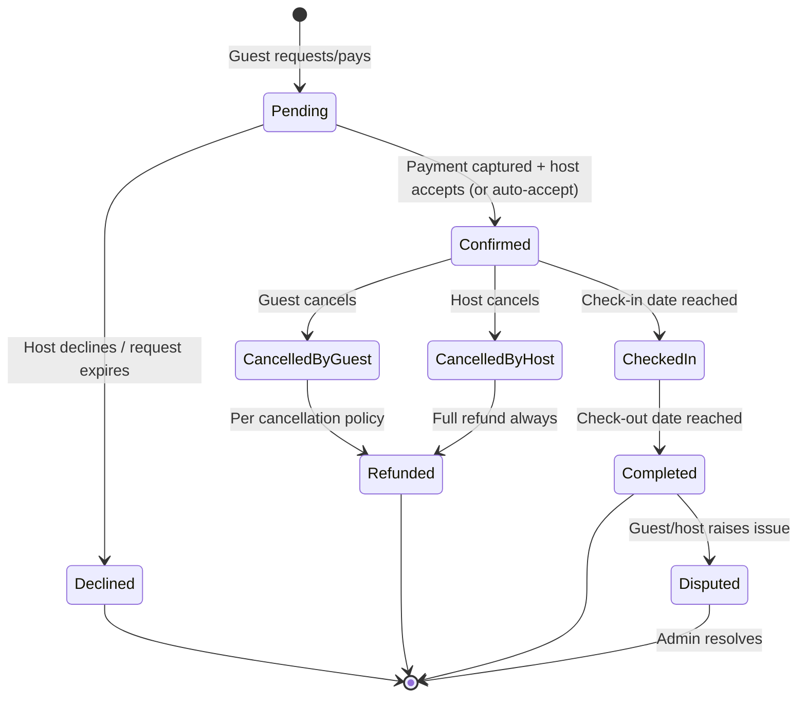
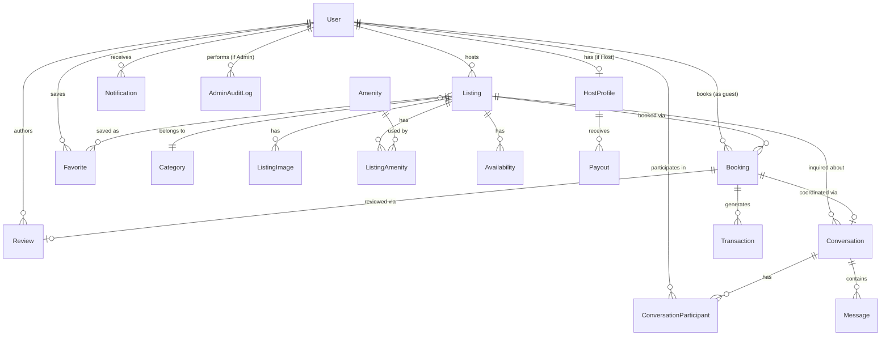

# Platform Architecture Blueprint

**Status:** Source of truth. This document defines the platform we are building — it is independent of Chisfis. Chisfis is referenced only in the final section, as a UI/component donor. No code has been written against this document yet; it is the design to implement against.

**Key assumptions (flag anything you want to override before implementation starts):**

| Assumption | Why | Override cost if wrong |
|---|---|---|
| Single listing vertical: short-term **property/stay rentals** (not cars/experiences/flights/real estate) | Prior assessment (§4/§13/§19 of the Chisfis audit) found multi-vertical support was the root cause of nearly all type/component duplication in the template. Repo origin (`Airbnb`) also points at stays. | Low now, high later — this is the decision the rest of the doc is built on |
| **Stripe Connect** for payments | Industry-standard for two-sided marketplaces (host payouts + platform fee in one flow) | Medium — payment module is isolated behind an interface (§6) |
| **PostgreSQL + Prisma** for persistence | Matches DB-readiness recommendation in prior audit; App Router pairs naturally with Prisma | Low — no code written against it yet |
| **NextAuth (Auth.js)** for authentication | Already a dependency; needs relocation/reconfiguration, not replacement | Low |
| No public REST API for external clients (mobile app, partners) at MVP | Nothing in scope indicates a non-Next.js client yet | Low — API boundaries (§13) are designed so this can be added later without rework |
| Listing moderation (admin approval before publish) is **optional/toggleable**, not mandatory at MVP | Keeps time-to-first-listing low; can be turned on via a platform setting once trust/safety matters more | Low |

---

## 1. User Roles & Permissions

Roles are **not mutually exclusive** — a single `User` can hold multiple roles (e.g. someone who is both a guest and a host). Model role as a set, not a single enum column.

| Role | Description | Key permissions |
|---|---|---|
| **Guest** (default, any authenticated user) | Books stays | Search/browse, book, message hosts, leave reviews on completed stays, manage own profile/favorites |
| **Host** | Lists properties | Everything Guest can do, plus: create/edit/publish/pause listings, manage availability & pricing, accept/decline bookings (if manual approval enabled), message guests, view earnings/payouts, respond to reviews |
| **Admin** | Platform operator | Moderate listings, manage users (suspend/verify), oversee bookings/disputes, issue manual refunds, manage categories/amenities, view platform-wide analytics, configure platform settings, view audit log |
| **Unauthenticated visitor** | Not a stored role | Search/browse/view listings only; any write action (favorite, message, book) redirects to login |

**Permission enforcement:** centralize in one authorization layer (`lib/auth.ts` — role/ownership checks), never scattered per-page `if` checks. Every mutation checks both **role** (is this user a Host at all?) and **ownership** (is this Host the owner of *this* listing?) — the second check is the one Chisfis has zero examples of and is easy to forget.

---

## 2. Listing Lifecycle



- **Draft**: incomplete listing, only visible to the host, saved incrementally as the add-listing wizard progresses (fixes Chisfis's wizard, which currently loses all data between steps — see §17).
- **PendingReview**: submitted, awaiting admin moderation (only reachable if the platform setting `listingModerationEnabled` is on).
- **Published**: live, searchable, bookable.
- **Paused**: host-initiated, hidden from search, existing confirmed bookings still honored.
- **Archived**: soft-deleted, not shown anywhere, retained for historical booking/review integrity (never hard-delete a listing that has bookings attached).

A listing's **availability** and **pricing** are versioned data attached to the listing (§12), not baked into the listing row, so past bookings retain the price/terms that applied when they were made even if the host later changes them.

---

## 3. Booking Lifecycle



- **Pending**: PaymentIntent created, funds authorized (not yet captured, or captured-and-held depending on chosen Stripe flow — see §6), host has a decision window if manual-accept is enabled for that listing.
- **Confirmed**: booking is real — dates are now blocked on the listing calendar, both parties can message, notifications fire.
- **CheckedIn / Completed**: date-driven transitions (a scheduled job flips these, not user action), Completed is what unlocks reviews (§9).
- **Cancellation**: refund amount is policy-driven (flexible/moderate/strict — a property of the listing, chosen by the host at listing-creation time), computed server-side, never trust a client-submitted refund amount.
- **Disputed**: rare path, routes to admin queue (§11) for manual resolution — not automated.

This directly replaces the Chisfis flow, where price is a hardcoded, internally-inconsistent string on two different pages and no state carries between them (prior audit, §6).

---

## 4. Search Architecture

**Principle: the URL is the single source of truth for search state.** This is the direct fix for Chisfis's search, where every input held isolated local state that never reached the results grid.

- **Query params** (`?location=&checkin=&checkout=&guests=&minPrice=&maxPrice=&amenities=&propertyType=&sort=`) drive a server-side query — parsed in a Server Component, not client `useState`.
- **Filter UI components** (location input, date range, guest counter, price slider, amenity checkboxes) are controlled inputs whose `onChange` updates the URL (`router.replace` with shallow routing), not local component state that dead-ends.
- **Availability-aware search**: when `checkin`/`checkout` are present, exclude listings with overlapping confirmed bookings or host-blocked dates for that range — this is a real query against the Availability table (§12), not decorative.
- **Sorting**: price asc/desc, rating desc, newest — a `sort` param mapped to an `ORDER BY` clause.
- **Pagination**: offset/limit at MVP scale; revisit cursor-based pagination only if/when listing volume demands it.
- **MVP search engine**: PostgreSQL — `tsvector` full-text index on title/description, standard B-tree indexes on category/price/location, bounding-box or PostGIS radius query for geo search.
- **Scale path**: search logic lives behind one function, `searchListings(params)`. When full-text relevance, typo tolerance, or geo performance outgrow Postgres, swap the implementation for a dedicated engine (Meilisearch/Typesense/Algolia) fed by a sync job on listing create/update — **the calling code and URL contract never change.**

---

## 5. Payment Architecture

**Model: Stripe Connect (destination charges).** Guest pays the platform; the platform automatically splits the payment — most goes to the host's connected account, the platform keeps a service fee — in a single PaymentIntent.

```
Guest checkout
  → create PaymentIntent (amount = total, application_fee_amount = platform fee,
      transfer_data.destination = host's Stripe connected account)
  → Stripe Elements collects card client-side (raw card data never touches our server —
      fixes the Chisfis anti-pattern of a plaintext card-number <input>)
  → on confirm: Booking.status = Pending
  → webhook `payment_intent.succeeded` (POST /api/webhooks/stripe, signature-verified, idempotent)
      → Booking.status = Confirmed
      → Transaction row recorded
      → notifications fired (§8)
  → payout to host's connected account: immediate (destination charge) or delayed until
      check-in per platform policy — configurable, not hardcoded
  → cancellation/refund: refund amount computed server-side from the listing's cancellation
      policy, issued via Stripe Refund API, webhook updates Booking + Transaction state
```

- **Money is stored as integer minor units (cents) + an explicit currency code** on every monetary field, from day one — retrofitting this later is painful.
- **Single currency at MVP** (e.g. USD); the integer-cents + currency-code convention means adding currencies later is a display/conversion concern, not a schema migration.
- **PCI scope**: minimized to "SAQ A" by using Stripe Elements/Checkout exclusively — no card data ever reaches our server or database.
- **Payout module** is a distinct concern from the Booking/Payment tables (a host may batch multiple bookings into one payout run) — see `Payout` entity, §12.

---

## 6. Messaging Architecture

- **`Conversation`** is the container — optionally linked to a `Booking` (post-booking coordination) or a `Listing` (pre-booking inquiry, no booking yet). Participants via a join table, not a fixed guest/host pair, so future group scenarios (co-hosts) aren't a schema change.
- **Message send = one server action**: insert `Message` row, update `Conversation.lastMessageAt`, trigger a `Notification` (§8) to the other participant(s).
- **Delivery, MVP**: client polling / SWR revalidation on an interval, or Postgres `LISTEN`/`NOTIFY` for near-real-time without adding infrastructure.
- **Scale path**: if true real-time (typing indicators, instant delivery) becomes a requirement, introduce a managed WebSocket layer (Pusher/Ably) or a small dedicated socket service — deliberately deferred, not built speculatively.
- **Attachments** (optional): stored in object storage (§16), `Message` row references the URL, not the binary.

---

## 7. Notification Architecture

- **Event-driven, not tightly coupled to business logic.** A domain action (booking confirmed, message received, review posted, payout sent, listing approved/rejected) emits an event; a notification dispatcher fans it out to the right channels. This keeps `modules/booking` from needing to know how email works.
- **Channels**: in-app (a `Notification` row + unread badge, always on), email (transactional, via a provider like Resend/Postmark — required for anything time-sensitive like booking confirmations), push (deferred — not MVP).
- **`NotificationPreference`** per user per notification-type/channel, so users can opt out of non-critical notifications (e.g. "new message" email) without losing critical ones (e.g. booking confirmation).
- **MVP dispatch mechanism**: synchronous within the request for in-app rows; email sends queued (even a simple DB-backed job table is enough at MVP — see §16) so a slow email provider never blocks a user-facing request.

---

## 8. Review System

- **Two-sided, double-blind**: guest reviews the listing/host, host reviews the guest. Neither is visible to the other party (or publicly) until **both** have submitted, or a 14-day window expires — standard marketplace pattern that reduces retaliatory/biased reviews. This is a deliberate design choice, not present in Chisfis at all (which has no submission form, only hardcoded display).
- **Eligibility**: only bookings with `status = Completed` can be reviewed; enforced server-side, not just hidden in the UI.
- **Rating shape**: overall rating (1–5) plus optional sub-ratings (cleanliness, accuracy, communication, location, value) for guest→listing reviews; a single overall rating for host→guest reviews.
- **Aggregation**: `Listing.avgRating` / `Listing.reviewCount` are denormalized fields, recalculated on review write — avoids an aggregate query on every listing-card render.
- **Host response**: one public reply per review, host-authored, permanently attached.
- **Moderation**: admin can soft-hide a review that violates content policy; action is audit-logged (§11), never a silent hard delete.

---

## 9. Dashboard Responsibilities

| Dashboard | Audience | Responsibilities |
|---|---|---|
| **Guest dashboard** | Any authenticated user, guest-facing view | Upcoming/past bookings, favorites/saved listings, messages, profile & payment methods, pending review prompts |
| **Host dashboard** | Users with the Host role | Listings (CRUD, publish/pause), booking/reservation management (calendar view, accept/decline if manual approval), earnings & payout history, messages, listing performance (views, conversion — later phase), reviews received |
| **Admin dashboard** | Admin role only | Listing moderation queue, user management (suspend/verify), booking oversight & dispute resolution, manual refunds/adjustments, category/amenity taxonomy management, platform settings (fees, moderation toggle, cancellation policy defaults), platform-wide analytics, audit log |

A single logged-in user with both Guest and Host roles sees a **role switcher**, not two separate accounts — this determines the auth/session design in §1: role is a property of the session, not the account type.

---

## 10. Admin Capabilities

- **Trust & safety**: approve/reject pending listings, suspend/ban users, soft-hide reviews, resolve disputed bookings.
- **Financial oversight**: view all transactions/payouts, issue manual refunds outside the standard cancellation flow, adjust a booking in exceptional cases.
- **Taxonomy management**: CRUD on categories and amenities (the controlled vocabularies listings are built from) — admin-editable, not hardcoded constants like in Chisfis (`navigation.ts`, `contains/contants.ts`).
- **Platform configuration**: service fee percentage, cancellation policy templates, whether listing moderation is required, feature flags for phased rollout.
- **Analytics**: GMV, active listings, booking volume/conversion, top-performing listings — read-only aggregate views.
- **Accountability**: every admin mutation (approve, suspend, refund, edit) writes an `AdminAuditLog` row — who, what, when, on what target. Any support-impersonation feature must be logged the same way.

---

## 11. Core Database Entities

| Entity | Purpose |
|---|---|
| `User` | Account record; roles as a set; profile fields |
| `HostProfile` | 1:1 extension of `User` when the Host role is active — bio, response rate, Stripe Connect account ID, verification status |
| `Listing` | A bookable property; status per §2 |
| `ListingImage` | Ordered images belonging to a listing |
| `Category` | Property type taxonomy (admin-managed) |
| `Amenity` | Feature taxonomy (admin-managed); `ListingAmenity` join table |
| `Availability` | Date-range blocks per listing — `booked` (derived from confirmed bookings) or `host_blocked` (manual) |
| `Booking` | A reservation; status per §3; snapshotted price/terms at time of booking |
| `Transaction` | A Stripe-linked money movement (`charge`/`refund`/`payout`) tied to a booking |
| `Payout` | A host payout run, may aggregate multiple bookings |
| `Review` | Two-sided per §9; polymorphic-ish via `targetType`/`targetId`, or two explicit FK columns (`listingReview`, `guestReview`) — recommend explicit columns for query simplicity over generic polymorphism |
| `Conversation` / `ConversationParticipant` | Messaging container + membership |
| `Message` | A single message within a conversation |
| `Notification` | In-app notification record |
| `NotificationPreference` | Per-user opt-in/out per type/channel |
| `Favorite` | Saved-listing join (`userId`, `listingId`) |
| `AdminAuditLog` | Admin action accountability trail |

---

## 12. Entity Relationships



---

## 13. API Boundaries

- **Server Actions are the default interface** for first-party mutations (create booking, publish listing, send message) — colocated with calling UI, fully type-safe, no hand-maintained REST contract needed for a Next.js-only client.
- **Reserve real `route.ts` endpoints for:**
  - **Webhooks** — `POST /api/webhooks/stripe` (payment/payout events), any future third-party callback. Must verify signatures and be idempotent.
  - **Auth** — `/api/auth/[...nextauth]/route.ts` (the App Router–correct location; fixes the Chisfis defect where this handler is dead code at the wrong path).
  - **Anything a non-Next client needs** — deliberately not built yet (see assumptions table); if a mobile app or partner integration becomes real, version it under `/api/v1/...` at that point.
- **Module-internal boundary rule**: each domain module (`modules/listings`, `modules/booking`, etc.) exposes its server actions/queries as its only public surface (e.g. `listings/actions.ts`, `listings/queries.ts`). Other modules call *through* that surface, never import another module's Prisma model directly. This is what keeps a monolith's modules independently reasoned-about and makes a future service extraction (e.g. pulling search or payments into its own service) a boundary that already exists in the code, not a new one to carve out under pressure.

---

## 14. Folder / Module Architecture

```
src/
  app/                        # routing only — thin; pages call into modules, no business logic here
    (marketing)/               # public marketing pages (minimal, de-Chisfis'd)
    (guest)/                   # guest-facing routes: search, listing detail, checkout, guest dashboard
    (host)/                    # host dashboard: listings, bookings, earnings, add-listing wizard
    (admin)/                   # admin dashboard
    api/
      webhooks/stripe/route.ts
      auth/[...nextauth]/route.ts

  modules/                     # one folder per domain — the real architecture lives here
    auth/
    users/
    listings/
      components/              # module-specific UI (ListingCard, ListingForm, etc.)
      actions.ts                # server actions (mutations)
      queries.ts                # server-side data fetching
      types.ts
      schema.ts                 # zod validation, shared by form + action
    search/
    booking/
    payments/
    messaging/
    notifications/
    reviews/
    admin/

  components/
    ui/                         # design-system primitives — reused from Chisfis src/shared
    layout/                     # header, footer, nav shell — reused/rewritten from Chisfis

  lib/
    db.ts                       # Prisma client singleton
    stripe.ts
    auth.ts                     # session/role/ownership checks — single source of truth
    email.ts

  types/                        # cross-module shared types only (avoid dumping everything here)
  styles/                       # kept from Chisfis's CSS-variable theming pattern

prisma/
  schema.prisma
```

This replaces Chisfis's category-route-group pattern (`(car-listings)/`, `(experience-listings)/`, etc. — one group per *listing type*) with role-based route groups (`(guest)/`, `(host)/`, `(admin)/`) plus a `modules/` layer organized by *domain*, matching the single-vertical decision in the assumptions table and the module-boundary rule in §13.

---

## 15. Scalability Considerations

- **Database**: Postgres with indexes matched to the search/filter query shapes in §4; add a read replica only once read load actually demands it, not preemptively.
- **Caching**: Redis for session storage, rate limiting, and hot-path data (e.g. popular listing pages); Next.js ISR/full-route caching for listing detail pages, which are read-heavy and change infrequently.
- **Search**: start on Postgres; graduate to a dedicated engine behind the `searchListings()` interface (§4) only when relevance/geo/typo-tolerance needs outgrow it.
- **Media**: object storage (S3-compatible) + CDN for all listing images — never repo-bundled assets (Chisfis ships ~150 template images in-repo, including irrelevant stock photos and even brand-guideline PDFs).
- **Background jobs**: a queue (start as simple as a DB-backed job table; graduate to BullMQ+Redis) for email sending, payout processing, and search-index sync — keeps user-facing requests fast and decouples slow third-party calls (email/Stripe) from the request path.
- **Rate limiting & abuse protection**: on public-facing mutation endpoints (search, messaging, review submission, signup) to prevent scraping/spam.
- **Stateless app tier**: no in-memory session/state in the Next.js layer — everything durable lives in Postgres/Redis/object storage, so the app tier scales horizontally (serverless or multi-instance) without sticky sessions.
- **Money correctness**: integer-cents + explicit currency from day one (§5) — the cheapest time to get this right is before the first row is written.
- **Observability**: structured logging + error tracking (e.g. Sentry) from the first payment-touching feature — a marketplace with money and bookings flowing through it is expensive to debug blind.

---

## 16. Chisfis Component Disposition

Cross-referenced against the prior technical assessment (`docs/architecture/chisfis-technical-assessment.md`).

**Reused as-is (visual/primitive layer, minimal or no change):**
- `src/shared/` primitives: `Button`/`ButtonPrimary`/`ButtonSecondary`/`ButtonThird`, `Input`, `Textarea`, `Select`, `Checkbox`, `Avatar`, `Badge`, `NcModal`, `Pagination`, `Nav`/`NavItem`, `Navigation/*`.
- `GallerySlider`, `listing-image-gallery/*`, date-picker customization renderers (`DatePickerCustomDay`, etc.).
- Tailwind + CSS-variable theming pattern (`__theme_colors.scss`).
- Dependencies: `framer-motion`, `@headlessui/react`, `@heroicons/react`, `react-datepicker`, `rc-slider`, `google-map-react`.

**Rewritten (keep the visual shell, replace the logic underneath):**
- `StayCard`/`CarCard`/`ExperiencesCard` → one generic `ListingCard` component (no more category-duplicated cards, since the platform is single-vertical).
- `LocationInput`/`StayDatesRangeInput`/`GuestsInput`/`TabFilters` → same visual components, rewired to the URL-driven search state in §4 instead of dead-end local state.
- Listing detail page → dynamic `[slug]` route reading real `Listing` data instead of hardcoded per-category content.
- `checkout/` flow, `SectionDateRange` → real availability + pricing + Stripe Elements per §5/§3, replacing the hardcoded/inconsistent price strings.
- `(account-pages)/*` → real forms (react-hook-form + zod) bound to actual user/booking/payout data per §9.
- `add-listing/[[...stepIndex]]/*` → shared wizard state (persisted draft per §2) instead of the current stateless, data-losing steps.
- `login`/`signup` → wired to NextAuth `signIn()`/`signOut()` at the corrected route (§13).
- `CommentListing` display component → kept as the display half of the real two-sided review system in §9; a submission form is added (none currently exists).

**Removed:**
- All non-stay verticals and their routes/components: `(car-listings)`, `(experience-listings)`, `(flight-listings)`, `(real-estate-listings)` and their cards/search-forms, per the single-vertical decision.
- Marketing/demo routes: `about`, `blog` (+ `[...slug]`), `author`, `subscription`, duplicate homepages `home-2`/`home-3`.
- Line Awesome icon font (`src/fonts/`) — consolidating to Heroicons only.
- Dead `api/hello/` files (stub route + misplaced NextAuth config).
- Hardcoded Google Maps API key in `PageAddListing2` (security fix, independent of everything else — rotate immediately).
- `a0.muscache.com` (Airbnb CDN) from `next.config.js`, and all literal Airbnb-branded copy (e.g. `account-billing` payout text).
- Component-level duplicates identified in the prior audit once each is touched by the phases above: `SwitchDarkMode2`, `NcPlayIcon2`, `SocialsList1`/`SocialsShare` (consolidate to one), `Heading2`, redundant `CardCategory1/3/4/5/6` variants.
- `src/data/` mock JSON/`DEMO_*` arrays — retained only as a seed script for local dev/test fixtures once the database is live, not shipped as production data.
