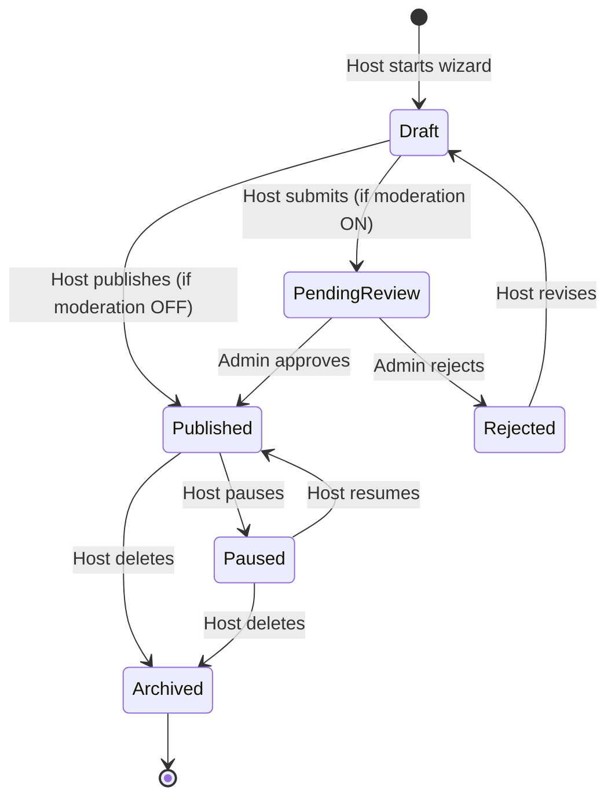
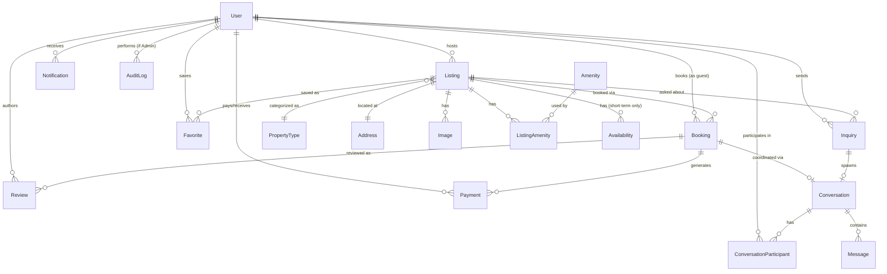

# Platform Architecture Blueprint

**Status:** Source of truth. This document defines the platform we are building — it is independent of Chisfis. Chisfis is referenced only in the final section, as a UI/component donor. No code has been written against this document yet; it is the design to implement against.

**Entity-level detail lives in `docs/architecture/domain-model-specification.md`** — this document stays system/architecture-level; the Domain Model Specification is the authoritative source for field lists, validation rules, and per-entity lifecycles.

**Frozen as of the pre-implementation review** (`docs/architecture/pre-implementation-review.md`) — that review adversarially challenged every major decision below and found 13 concrete gaps, all now fixed in place in this document and the Domain Model Specification. See that review for the reasoning behind each fix; this document states only the resulting decisions.

**Confirmed scope (client-decided, no longer an assumption):** property-only platform (residential and commercial buildings, no cars/experiences/flights) supporting **two rental transaction types on one unified `Listing` model — short-term (nightly/weekly) and long-term (monthly/annual lease)**. See Domain Model Specification §0 for the full rationale on why this is one entity with conditional fields, not two.

**Remaining assumptions (flag anything you want to override before implementation starts):**

| Assumption | Why | Override cost if wrong |
|---|---|---|
| **Payment provider abstraction** (interface + adapters), first adapter = Stripe Connect, with Paystack/Flutterwave as later adapters | Client requirement — booking/payment logic must not be tightly coupled to one gateway | Low — this is the point of the abstraction; adding a second adapter is additive |
| **PostgreSQL + Prisma** for persistence | Matches DB-readiness recommendation in prior audit; App Router pairs naturally with Prisma | Low — no code written against it yet |
| **NextAuth (Auth.js)** for authentication | Already a dependency; needs relocation/reconfiguration, not replacement | Low |
| No public REST API for external clients (mobile app, partners) at MVP | Nothing in scope indicates a non-Next.js client yet | Low — API boundaries (§13) are designed so this can be added later without rework |
| Listing moderation (admin approval before publish) is **optional/toggleable**, not mandatory at MVP | Keeps time-to-first-listing low; can be turned on via a platform setting once trust/safety matters more | Low |

---

## 1. User Roles & Permissions

Roles are **not mutually exclusive** — a single `User` can hold multiple roles (e.g. someone who is both a guest and a host). Model role as a set, not a single enum column.

| Role | Description | Key permissions |
|---|---|---|
| **Guest** (default, any authenticated user) | Books stays | Search/browse, book, message hosts, leave reviews on completed stays, manage own profile/favorites |
| **Host** | Lists properties | Everything Guest can do, plus: create/edit/publish/pause listings, manage availability & pricing, accept/decline bookings (if manual approval enabled), message guests, view earnings/payouts, respond to reviews |
| **Admin** | Platform operator | Moderate listings, manage users (suspend/verify), oversee bookings/disputes, issue manual refunds, manage categories/amenities, view platform-wide analytics, configure platform settings, view audit log |
| **Unauthenticated visitor** | Not a stored role | Search/browse/view listings only; any write action (favorite, message, book) redirects to login |

**Permission enforcement:** centralize in one authorization layer (`lib/auth.ts` — role/ownership checks), never scattered per-page `if` checks. Every mutation checks both **role** (is this user a Host at all?) and **ownership** (is this Host the owner of *this* listing?) — the second check is the one Chisfis has zero examples of and is easy to forget.

**Enforcement pattern, made explicit in the pre-implementation review:** `requireRole()`/`requireOwnership()` guard calls must be the first line of every mutating Server Action — a convention, not just an available helper, so it can't be silently skipped in one module while used everywhere else.

**Password reset:** a token-based, single-use, time-limited, rate-limited forgot-password flow is required — flagged as missing from the original draft during the security review and added as required Auth-phase scope.

---

## 2. Listing Lifecycle



- **Draft**: incomplete listing, only visible to the host, saved incrementally as the add-listing wizard progresses (fixes Chisfis's wizard, which currently loses all data between steps — see §17).
- **PendingReview**: submitted, awaiting admin moderation (only reachable if the platform setting `listingModerationEnabled` is on).
- **Published**: live, searchable, bookable.
- **Paused**: host-initiated, hidden from search, existing confirmed bookings still honored.
- **Archived**: soft-deleted, not shown anywhere, retained for historical booking/review integrity (never hard-delete a listing that has bookings attached).

A listing's **availability** and **pricing** are versioned data attached to the listing (§12), not baked into the listing row, so past bookings retain the price/terms that applied when they were made even if the host later changes them.

---

## 3. Booking Lifecycle

**One `Booking` entity covers both rental types** — `rentalType` (snapshotted from the listing) determines which status subset and date fields apply. Full field-level detail and both state diagrams (short-term reservation vs. long-term lease) are in **Domain Model Specification §2.9** — summarized here:

- **Pending**: payment/application in progress — for short-term, a charge is authorized; for long-term, the security deposit + first month's rent are captured at lease signing. Host has a decision window if manual-accept is enabled for that listing.
- **Confirmed**: booking is real. Short-term: dates are now blocked on the listing's `Availability` calendar. Long-term: lease is signed, awaiting move-in date. Both parties can message; notifications fire.
- **Short-term only — CheckedIn → Completed**: date-driven transitions (a scheduled job flips these), Completed unlocks reviews (§8).
- **Long-term only — Active → Completed / TerminatedEarly**: Active once the move-in date is reached; Completed when the lease term ends naturally, TerminatedEarly for breach/mutual agreement.
- **Cancellation**: refund amount is policy-driven (flexible/moderate/strict for short-term; deposit-forfeiture rules for long-term — both properties of the listing, chosen by the host at listing-creation time), computed server-side, never trust a client-submitted refund amount.
- **Disputed**: rare path, routes to admin queue (§10) for manual resolution — not automated.

This directly replaces the Chisfis flow, where price is a hardcoded, internally-inconsistent string on two different pages and no state carries between them (prior audit, §6), and extends it to cover recurring long-term rent (§5 below), which Chisfis has no concept of at all.

---

## 4. Search Architecture

**Principle: the URL is the single source of truth for search state.** This is the direct fix for Chisfis's search, where every input held isolated local state that never reached the results grid.

- **`rentalType` is a required top-level query param** (`SHORT_TERM` or `LONG_TERM`) — it determines which secondary filters render and which query branch runs (nightly dates + price vs. move-in date + monthly rent). Both branches resolve through one `searchListings(params)` function that dispatches internally on `rentalType`; see Domain Model Specification §3 for the full filter/facet mapping.
- **Query params** (`?rentalType=&location=&checkin=&checkout=&moveIn=&guests=&minPrice=&maxPrice=&amenities=&propertyType=&sort=`) drive a server-side query — parsed in a Server Component, not client `useState`.
- **Filter UI components** (location input, date range, guest counter, price slider, amenity checkboxes) are controlled inputs whose `onChange` updates the URL (`router.replace` with shallow routing), not local component state that dead-ends.
- **Availability-aware search**: when `checkin`/`checkout` are present, exclude listings with overlapping confirmed bookings or host-blocked dates for that range — this is a real query against the Availability table (§12), not decorative.
- **Sorting**: price asc/desc, rating desc, newest — a `sort` param mapped to an `ORDER BY` clause.
- **Pagination: cursor-based from day one**, not offset/limit. *(Corrected in pre-implementation review — offset pagination degrades non-linearly as the table grows, and switching strategy later is a breaking URL/API contract change for every consumer, not an internal refactor. Cursor pagination on an indexed sort key costs no more to build now.)*
- **MVP search engine**: PostgreSQL — `tsvector` full-text column with a **GIN index** (a plain B-tree index does not support full-text match operators — this was previously unstated), standard B-tree indexes on category/price/location, `geography(Point)`-typed location column with a GIST index enabled from day one even though the radius query itself is deferred (retrofitting the column type later requires a backfill migration; enabling it now does not).
- **Cache invalidation**: listing writes (`modules/listings/actions.ts`) call `revalidateTag('listing:{id}')` on publish/update/pause — stated explicitly because ISR without a wired invalidation trigger silently serves stale listing pages indefinitely.
- **Scale path**: search logic lives behind one function, `searchListings(params)`. When full-text relevance, typo tolerance, or geo performance outgrow Postgres — concretely, when p95 search latency exceeds ~300ms or a single metro area exceeds ~50k active listings, not just "when it feels slow" — swap the implementation for a dedicated engine (Meilisearch/Typesense/Algolia) fed by a sync job on listing create/update — **the calling code and URL contract never change.**

---

## 5. Payment Architecture

**Not tightly coupled to any single gateway.** All booking/payment business logic calls a `PaymentProvider` interface (`lib/payments/`); concrete gateways (Stripe Connect first, Paystack/Flutterwave as later adapters) are swappable implementations behind it. Full interface shape and rationale: Domain Model Specification §6.

```
PaymentProvider (interface)
  createCharge(amount, currency, payerRef, metadata) → { providerTransactionRef, status }
  refund(providerTransactionRef, amount?) → { status }
  createPayeeAccount(user) → payoutAccountRef      // host payout onboarding
  payout(payoutAccountRef, amount, currency) → { providerTransactionRef, status }
  verifyWebhookSignature(payload, signature) → boolean
  parseWebhookEvent(payload) → NormalizedPaymentEvent
```

- **`Payment` (formerly "Transaction")** is the one DB entity for every money movement (charge/refund/payout/deposit-hold/deposit-release), and it is **provider-agnostic by design** — it stores a `provider` enum + opaque `providerTransactionRef`, never gateway-specific field names. See Domain Model Specification §2.14.
- **Webhook endpoints are per-adapter** (`/api/webhooks/stripe`, `/api/webhooks/paystack`, …), each verifying its own signature and normalizing the event before handing it to shared domain logic — the booking/payment state-transition code never knows which provider fired.
- **Flow differs by rental type, not by provider** (Domain Model Specification §4):
  - **Short-term**: one `createCharge` at booking confirmation (full stay total, or deposit+balance per policy).
  - **Long-term**: a `SECURITY_DEPOSIT_HOLD` charge at lease signing, then one `createCharge` per billing period for the lease duration — scheduled by our own background job (§15), not a provider "subscription" feature (subscription semantics differ too much across gateways to build the abstraction around them). A `RENT_DUE_REMINDER` notification fires ahead of each due date.
- **Charge/payout model, decided in pre-implementation review: separate charges and transfers, not Stripe destination charges.** Guest payments land in the platform's own Stripe balance; the platform explicitly calls `payout()` to move a host's share to their connected account on a chosen schedule. This was previously undecided — the interface's `payout()` method implied this model but nothing ruled out destination charges, which move funds to the connected account atomically at charge time and **cannot** be held for any buyer-protection window. Separate charges + transfers is the only model compatible with holding a short-term payout until check-in, or holding long-term rent until a dispute window closes.
- **Stripe Connect account type, decided in pre-implementation review: Express.** Stripe-hosted onboarding means the platform never collects/stores KYC data (SSN, DOB, bank details) itself — consistent with `User.payoutAccountRef` being the only payout-related field on `User`. Express matches that intent: faster onboarding than Standard, less platform liability than Custom.
- **Webhook robustness, three requirements made explicit in the pre-implementation review:**
  1. **Duplicate delivery**: `Payment.providerTransactionRef` being unique gives idempotency for the row, but the handler's side effects (status transitions, notifications) must independently check for an already-`SUCCEEDED` `Payment` with that ref and short-circuit — providers do not guarantee exactly-once delivery.
  2. **Out-of-order delivery**: providers do not guarantee event ordering. Treat each event as "a fact occurred," re-deriving current state where ordering ambiguity is possible, rather than blindly applying events in arrival order.
  3. **Chargebacks/disputes**: a bank-initiated dispute (`charge.dispute.created`) is distinct from a platform-initiated refund — handled via the `Payment.type = CHARGEBACK` value (Domain Model Specification §2.14), which additionally flags the related `Booking` for admin review rather than continuing its normal lifecycle silently.
- **Money is stored as integer minor units (cents) + an explicit currency code** on every monetary field, from day one — retrofitting this later is painful.
- **Single currency at MVP** (e.g. USD); the integer-cents + currency-code convention means adding currencies later is a display/conversion concern, not a schema migration.
- **PCI scope**: minimized by using each provider's hosted card-collection UI (e.g. Stripe Elements) exclusively — no card data ever reaches our server or database. **Explicit rule, not just an assumption: a raw card-number `<input>` must never be built.** This is precisely Chisfis's original defect (a plaintext card-number field with a hardcoded demo value), and given that exact anti-pattern already exists in this repo's history, it's stated here as a hard rule rather than left implicit.
- **Payouts are modeled as `Payment(type = PAYOUT)`**, not a separate entity — MVP is one payout per booking; see Domain Model Specification §7 (Design Decisions Log) for why a dedicated `Payout` entity was deliberately not introduced yet.
- **Only the Stripe Connect adapter is built at MVP.** Paystack/Flutterwave remain named in the `Payment.provider` enum (cost-free) but their adapters are not implemented until a real requirement exists — building three adapters against one confirmed provider would be premature.

---

## 6. Messaging Architecture

- **`Conversation`** is the container — optionally linked to a `Booking` (post-booking coordination) or a `Listing` (pre-booking inquiry, no booking yet). Participants via a join table, not a fixed guest/host pair, so future group scenarios (co-hosts) aren't a schema change.
- **Message send = one server action**: insert `Message` row, update `Conversation.lastMessageAt`, trigger a `Notification` (§8) to the other participant(s).
- **Delivery, MVP**: client polling / SWR revalidation on an interval, or Postgres `LISTEN`/`NOTIFY` for near-real-time without adding infrastructure.
- **Scale path**: if true real-time (typing indicators, instant delivery) becomes a requirement, introduce a managed WebSocket layer (Pusher/Ably) or a small dedicated socket service — deliberately deferred, not built speculatively.
- **Attachments** (optional): stored in object storage (§16), `Message` row references the URL, not the binary.

---

## 7. Notification Architecture

- **Event-driven, not tightly coupled to business logic.** A domain action (booking confirmed, message received, review posted, payout sent, listing approved/rejected) emits an event; a notification dispatcher fans it out to the right channels. This keeps `modules/booking` from needing to know how email works.
- **Channels**: in-app (a `Notification` row + unread badge, always on), email (transactional, via a provider like Resend/Postmark — required for anything time-sensitive like booking confirmations), push (deferred — not MVP).
- **`NotificationPreference`** per user per notification-type/channel, so users can opt out of non-critical notifications (e.g. "new message" email) without losing critical ones (e.g. booking confirmation).
- **MVP dispatch mechanism**: synchronous within the request for in-app rows; email sends queued (even a simple DB-backed job table is enough at MVP — see §16) so a slow email provider never blocks a user-facing request.

---

## 8. Review System

- **Two-sided, double-blind**: guest reviews the listing/host, host reviews the guest. Neither is visible to the other party (or publicly) until **both** have submitted, or a 14-day window expires — standard marketplace pattern that reduces retaliatory/biased reviews. This is a deliberate design choice, not present in Chisfis at all (which has no submission form, only hardcoded display).
- **Eligibility**: only bookings with `status = Completed` can be reviewed; enforced server-side, not just hidden in the UI.
- **Rating shape**: overall rating (1–5) plus optional sub-ratings (cleanliness, accuracy, communication, location, value) for guest→listing reviews; a single overall rating for host→guest reviews.
- **Aggregation**: `Listing.avgRating` / `Listing.reviewCount` are denormalized fields, recalculated on review write — avoids an aggregate query on every listing-card render.
- **Host response**: one public reply per review, host-authored, permanently attached.
- **Moderation**: admin can soft-hide a review that violates content policy; action is audit-logged (§11), never a silent hard delete.

---

## 9. Dashboard Responsibilities

| Dashboard | Audience | Responsibilities |
|---|---|---|
| **Guest dashboard** | Any authenticated user, guest-facing view | Upcoming/past bookings, favorites/saved listings, messages, profile & payment methods, pending review prompts |
| **Host dashboard** | Users with the Host role | Listings (CRUD, publish/pause), booking/reservation management (calendar view, accept/decline if manual approval), earnings & payout history, messages, listing performance (views, conversion — later phase), reviews received |
| **Admin dashboard** | Admin role only | Listing moderation queue, user management (suspend/verify), booking oversight & dispute resolution, manual refunds/adjustments, category/amenity taxonomy management, platform settings (fees, moderation toggle, cancellation policy defaults), platform-wide analytics, audit log |

A single logged-in user with both Guest and Host roles sees a **role switcher**, not two separate accounts — this determines the auth/session design in §1: role is a property of the session, not the account type.

---

## 10. Admin Capabilities

- **Trust & safety**: approve/reject pending listings, suspend/ban users, soft-hide reviews, resolve disputed bookings.
- **Financial oversight**: view all transactions/payouts, issue manual refunds outside the standard cancellation flow, adjust a booking in exceptional cases.
- **Taxonomy management**: CRUD on categories and amenities (the controlled vocabularies listings are built from) — admin-editable, not hardcoded constants like in Chisfis (`navigation.ts`, `contains/contants.ts`).
- **Platform configuration**: service fee percentage, cancellation policy templates, whether listing moderation is required, feature flags for phased rollout.
- **Analytics**: GMV, active listings, booking volume/conversion, top-performing listings — read-only aggregate views.
- **Accountability**: every admin mutation (approve, suspend, refund, edit) writes an `AuditLog` row — who, what, when, on what target. Any support-impersonation feature must be logged the same way. **Scope broadened in pre-implementation review**: `AuditLog` also covers sensitive security events on any account (failed logins, password changes, payout-account changes), not admin actions alone — necessary for fraud investigation on a platform moving money.

---

## 11. Core Database Entities

**Full field-by-field detail (types, validation, status values, permissions, lifecycle, indexes) is the Domain Model Specification's job — see `docs/architecture/domain-model-specification.md` §2.** Summary of the entity set and what changed from the original draft of this document:

| Entity | Purpose | Note |
|---|---|---|
| `User` | Account record; roles as a set; profile fields | Host-specific fields (bio, response rate, payout reference) live directly on `User` — no separate `HostProfile` (deliberately not introduced, see spec §7) |
| `Listing` | A single unified property model — status per §2 | One entity for both rental types via a `rentalType` field + conditional fields, not per-type tables |
| `Image` | Ordered images belonging to a listing | Renamed from `ListingImage` |
| `PropertyType` | Property category taxonomy (admin-managed) | Renamed from `Category` |
| `Amenity` | Feature taxonomy (admin-managed); `ListingAmenity` join table | Unchanged |
| `Address` | Structured, normalized listing location | Added — was implicit in `Listing` before |
| `Availability` | Sparse date-blocks — **short-term listings only**; long-term occupancy is derived from an active `Booking`, no calendar table needed | Scope narrowed |
| `Inquiry` | Pre-booking contact before a formal `Booking` exists | Added |
| `Booking` | One unified reservation/lease entity; status subset and date fields depend on `rentalType`; snapshotted price/terms | Now explicitly covers both short-term reservations and long-term leases |
| `Payment` | A provider-agnostic money movement (`charge`/`refund`/`payout`/`deposit-hold`/`deposit-release`) tied to a booking | Renamed from `Transaction`; no gateway-specific fields (§5) |
| `Review` | Two-sided per §8, explicit `direction` enum, one row per direction | Direction approach confirmed, no generic polymorphism |
| `Conversation` / `ConversationParticipant` | Messaging container + membership | Unchanged |
| `Message` | A single message within a conversation | Unchanged |
| `Notification` / `NotificationPreference` | In-app/email notification record + per-user opt-in/out | Unchanged |
| `Favorite` | Saved-listing join (`userId`, `listingId`) | Unchanged |
| `AuditLog` | Admin action accountability trail | Renamed from `AdminAuditLog` |

**Not introduced** (and why, per Domain Model Specification §7): a separate `HostProfile` (folded into `User`), a separate `Payout` entity (modeled as `Payment(type=PAYOUT)`), and separate `ShortTermListing`/`LongTermListing` or `Booking`/`Lease` tables (one entity each, with conditional fields, per the client's explicit instruction to avoid premature polymorphism).

---

## 12. Entity Relationships



*(Full ERD with cardinality notes: Domain Model Specification §5.)*

---

## 13. API Boundaries

- **Server Actions are the default interface** for first-party mutations (create booking, publish listing, send message) — colocated with calling UI, fully type-safe, no hand-maintained REST contract needed for a Next.js-only client.
- **Reserve real `route.ts` endpoints for:**
  - **Webhooks** — `POST /api/webhooks/stripe` (payment/payout events), any future third-party callback. Must verify signatures and be idempotent.
  - **Auth** — `/api/auth/[...nextauth]/route.ts` (the App Router–correct location; fixes the Chisfis defect where this handler is dead code at the wrong path).
  - **Anything a non-Next client needs** — deliberately not built yet (see assumptions table); if a mobile app or partner integration becomes real, version it under `/api/v1/...` at that point.
- **Module-internal boundary rule**: each domain module (`modules/listings`, `modules/booking`, etc.) exposes its server actions/queries as its only public surface (e.g. `listings/actions.ts`, `listings/queries.ts`). Other modules call *through* that surface, never import another module's Prisma model directly. This is what keeps a monolith's modules independently reasoned-about and makes a future service extraction (e.g. pulling search or payments into its own service) a boundary that already exists in the code, not a new one to carve out under pressure.
- **Error contract, added in pre-implementation review**: every Server Action returns `{ success: true, data } | { success: false, error: { code, message, fieldErrors? } }` for *expected* failures (validation errors, "dates no longer available," permission denied) — only genuinely unexpected failures (DB connection lost) should throw and hit the Next.js error boundary. Throwing for both was the original gap: expected, routine failures like a booking conflict would otherwise produce a generic error screen instead of an actionable message.
- **Abuse prevention, added in pre-implementation review**: Server Actions have no built-in rate limiting. A Redis-backed sliding-window limiter (`lib/rate-limit.ts`), called from the same guard position as `requireRole()`/`requireOwnership()`, is required on: signup, `Inquiry` creation, `Message` creation, and `Review` submission — the endpoints most exposed to spam/abuse.
- **File upload security, added in pre-implementation review**: presigned direct-to-S3 upload URLs, never proxying raw file bytes through the Next.js server; server-side content-type/size validation before issuing the presigned URL; EXIF stripping during the async resize step already planned for `Image` (both for storage hygiene and to avoid leaking a host's precise GPS location beyond what they intended to disclose).

---

## 14. Folder / Module Architecture

```
src/
  app/                        # routing only — thin; pages call into modules, no business logic here
    (marketing)/               # public marketing pages (minimal, de-Chisfis'd)
    (guest)/                   # guest-facing routes: search, listing detail, checkout, guest dashboard
    (host)/                    # host dashboard: listings, bookings, earnings, add-listing wizard
    (admin)/                   # admin dashboard
    api/
      webhooks/stripe/route.ts    # one webhook route per active payment adapter
      auth/[...nextauth]/route.ts

  modules/                     # one folder per domain — the real architecture lives here
    auth/
    users/
    listings/
      components/              # module-specific UI (ListingCard, ListingForm, etc.)
      actions.ts                # server actions (mutations)
      queries.ts                # server-side data fetching
      types.ts
      schema.ts                 # zod validation, shared by form + action
    search/
    booking/
    payments/
    messaging/
    notifications/
    reviews/
    admin/

  components/
    ui/                         # design-system primitives — reused from Chisfis src/shared
    layout/                     # header, footer, nav shell — reused/rewritten from Chisfis

  lib/
    db.ts                       # Prisma client singleton
    payments/                   # PaymentProvider interface + adapters (stripe.ts, paystack.ts, flutterwave.ts)
    auth.ts                     # session/role/ownership checks — single source of truth
    email.ts

  types/                        # cross-module shared types only (avoid dumping everything here)
  styles/                       # kept from Chisfis's CSS-variable theming pattern
  jobs/                         # background/scheduled tasks — added in pre-implementation review
    expireStaleBookings.ts      # each file calls into a module's actions; never contains business logic itself
    chargeMonthlyRent.ts
    transitionListingStatuses.ts
    expireReviewWindow.ts

prisma/
  schema.prisma
```

This replaces Chisfis's category-route-group pattern (`(car-listings)/`, `(experience-listings)/`, etc. — one group per *listing type*) with role-based route groups (`(guest)/`, `(host)/`, `(admin)/`) plus a `modules/` layer organized by *domain*, matching the single-vertical decision in the assumptions table and the module-boundary rule in §13.

**`jobs/` gap, found in pre-implementation review:** both documents repeatedly reference "a scheduled job" (status transitions, monthly rent charges, review-window expiry, stale-inquiry expiry) but no folder previously owned this recurring concern. Each job file calls into the relevant module's existing actions — the rule that modules own their business logic still holds; `jobs/` only owns scheduling/orchestration. Testing convention: co-located `*.test.ts` per module (not a mirrored `__tests__/` tree) — noted here as a convention, not enforced by the folder structure itself, given booking/payment state-machine logic is the highest-risk code in the system.

---

## 15. Scalability Considerations

- **Database**: Postgres with indexes matched to the search/filter query shapes in §4; add a read replica only once read load actually demands it, not preemptively. **Connection pooling (PgBouncer, Prisma Accelerate, or the hosting provider's built-in pooling e.g. Neon/Supabase) is required from the initial database setup (implementation Phase 2), not deferred as a "later" scale concern** — corrected in the pre-implementation review. A serverless Next.js deployment without pooling exhausts Postgres's connection limit at a far lower concurrency than "1M listings" implies; connection exhaustion is the realistic first bottleneck, not listing count.
- **Caching**: Redis for session storage, rate limiting, and hot-path data (e.g. popular listing pages); Next.js ISR/full-route caching for listing detail pages, which are read-heavy and change infrequently.
- **Search**: start on Postgres; graduate to a dedicated engine behind the `searchListings()` interface (§4) only when relevance/geo/typo-tolerance needs outgrow it.
- **Media**: object storage (S3-compatible) + CDN for all listing images — never repo-bundled assets (Chisfis ships ~150 template images in-repo, including irrelevant stock photos and even brand-guideline PDFs).
- **Background jobs**: a queue (start as simple as a DB-backed job table; graduate to BullMQ+Redis) for email sending, payout processing, and search-index sync — keeps user-facing requests fast and decouples slow third-party calls (email/Stripe) from the request path.
- **Rate limiting & abuse protection**: on public-facing mutation endpoints (search, messaging, review submission, signup) to prevent scraping/spam.
- **Stateless app tier**: no in-memory session/state in the Next.js layer — everything durable lives in Postgres/Redis/object storage, so the app tier scales horizontally (serverless or multi-instance) without sticky sessions.
- **Money correctness**: integer-cents + explicit currency from day one (§5) — the cheapest time to get this right is before the first row is written.
- **Observability**: structured logging + error tracking (e.g. Sentry) from the first payment-touching feature — a marketplace with money and bookings flowing through it is expensive to debug blind.

---

## 16. Chisfis Component Disposition

Cross-referenced against the prior technical assessment (`docs/architecture/chisfis-technical-assessment.md`).

**Reused as-is (visual/primitive layer, minimal or no change):**
- `src/shared/` primitives: `Button`/`ButtonPrimary`/`ButtonSecondary`/`ButtonThird`, `Input`, `Textarea`, `Select`, `Checkbox`, `Avatar`, `Badge`, `NcModal`, `Pagination`, `Nav`/`NavItem`, `Navigation/*`.
- `GallerySlider`, `listing-image-gallery/*`, date-picker customization renderers (`DatePickerCustomDay`, etc.).
- Tailwind + CSS-variable theming pattern (`__theme_colors.scss`).
- Dependencies: `framer-motion`, `@headlessui/react`, `@heroicons/react`, `react-datepicker`, `rc-slider`, `google-map-react`.

**Rewritten (keep the visual shell, replace the logic underneath):**
- `StayCard`/`CarCard`/`ExperiencesCard` → one generic `ListingCard` component (no more category-duplicated cards, since the platform is single-vertical).
- `LocationInput`/`StayDatesRangeInput`/`GuestsInput`/`TabFilters` → same visual components, rewired to the URL-driven search state in §4 instead of dead-end local state.
- Listing detail page → dynamic `[slug]` route reading real `Listing` data instead of hardcoded per-category content.
- `checkout/` flow, `SectionDateRange` → real availability + pricing + Stripe Elements per §5/§3, replacing the hardcoded/inconsistent price strings.
- `(account-pages)/*` → real forms (react-hook-form + zod) bound to actual user/booking/payout data per §9.
- `add-listing/[[...stepIndex]]/*` → shared wizard state (persisted draft per §2) instead of the current stateless, data-losing steps.
- `login`/`signup` → wired to NextAuth `signIn()`/`signOut()` at the corrected route (§13).
- `CommentListing` display component → kept as the display half of the real two-sided review system in §9; a submission form is added (none currently exists).

**Removed:**
- All non-stay verticals and their routes/components: `(car-listings)`, `(experience-listings)`, `(flight-listings)`, `(real-estate-listings)` and their cards/search-forms, per the single-vertical decision.
- Marketing/demo routes: `about`, `blog` (+ `[...slug]`), `author`, `subscription`, duplicate homepages `home-2`/`home-3`.
- Line Awesome icon font (`src/fonts/`) — consolidating to Heroicons only.
- Dead `api/hello/` files (stub route + misplaced NextAuth config).
- Hardcoded Google Maps API key in `PageAddListing2` (security fix, independent of everything else — rotate immediately).
- `a0.muscache.com` (Airbnb CDN) from `next.config.js`, and all literal Airbnb-branded copy (e.g. `account-billing` payout text).
- Component-level duplicates identified in the prior audit once each is touched by the phases above: `SwitchDarkMode2`, `NcPlayIcon2`, `SocialsList1`/`SocialsShare` (consolidate to one), `Heading2`, redundant `CardCategory1/3/4/5/6` variants.
- `src/data/` mock JSON/`DEMO_*` arrays — retained only as a seed script for local dev/test fixtures once the database is live, not shipped as production data.

---

## 17. Implementation Roadmap

Reviewed and re-sequenced from the original proposed order during the pre-implementation review (`docs/architecture/pre-implementation-review.md` §10) — five sequencing risks found and fixed. This is the order implementation follows.

1. **Chisfis cleanup and project restructuring** — dependency/dead-code removal (Line Awesome font, dead `api/hello/` files, leaked Maps API key) happens first, before any new module scaffolding, so nothing new is written importing something already flagged for deletion.
2. **Prisma schema and PostgreSQL database** — with **connection pooling and every index from the Domain Model Specification included now**, not deferred to a later "performance" phase.
3. **Authentication and role system** — plus a minimal `notify()` primitive (writes a `Notification` row, no delivery yet) built here as shared infrastructure, since phases 8–10 need to call it.
4. **Property listing CRUD**
5. **Image upload and media management**
6. **Availability management** *(moved before Search — search's date-filtering depends on this data existing)*
7. **Search and filtering** *(moved after Availability, for the reason above)*
8. **Short-term and long-term rental workflows** — built against a `MockPaymentProvider` test double, not blocked on Stripe integration; this also dog-foods the `PaymentProvider` abstraction before phase 11 swaps in the real adapter.
9. **Messaging**
10. **Reviews and favorites**
11. **Stripe Connect payments and payouts** — swap `MockPaymentProvider` → `StripeConnectProvider`; separate-charges-and-transfers model; Express accounts (§5).
12. **Admin dashboard**
13. **Notifications** — email delivery and preferences UI; the emission primitive already exists from phase 3.
14. **Performance optimization** — load testing and query tuning under real traffic, **not** a catch-up phase for indexes that should already exist from phase 2.
15. **Final testing and production readiness**
